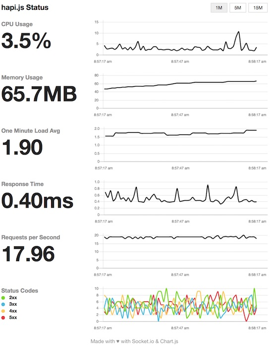

# hapijs-status-monitor

[](https://www.npmjs.com/package/hapijs-status-monitor)

Simple, self-hosted module based on [Socket.IO](http://socket.io) and
[Chart.js](http://www.chartjs.org) to report realtime server metrics for
[hapi.js](http://hapijs.com) servers.

**Inspired from [express-status-monitor](https://github.com/RafalWilinski/express-status-monitor)**



## Installation & setup

**Install package**

```sh
npm install hapijs-status-monitor --save
```

**Register plugin**

```js
server.register({
  register: require('hapijs-status-monitor')
});
```
**Run server and go to** `/status`

## Run examples

1. Go to `cd examples/`
2. Run `npm i`
3. Run server `npm start`
4. Go to `http://localhost:8000/status`

## Options

Monitor can be configured by passing options object into server register method

```js
server.register({
  register: require('hapijs-status-monitor'),
  options: {
    'your-options': 'here'
  }
});
```

Default options:

```js
title: 'hapi.js Status',
path: '/status',
spans: [{
  interval: 1,     // Every second
  retention: 60    // Keep 60 datapoints in memory
}, {
  interval: 5,     // Every 5 seconds
  retention: 60
}, {
  interval: 15,    // Every 15 seconds
  retention: 60
}]
```

## License

[MIT](./license.txt)
